title: Flyte: AI In Production
use_katex: False
class: title-slide


# AI in Production

.larger[Thomas J. Fan]<br>
@thomasjpfan<br>

<a href="https://www.github.com/thomasjpfan" target="_blank"><span class="fa-brands fa-github"></span></a>
<a href="https://www.linkedin.com/in/thomasjpfan" target="_blank"><span class="fa-brands fa-linkedin"></span></a>
<a href="https://www.twitter.com/thomasjpfan" target="_blank"><span class="fa-brands fa-twitter"></span></a>
<a class="this-talk-link", href="https://github.com/thomasjpfan/odsc-east-2024-flyte" target="_blank">
Slides on Github: github.com/thomasjpfan/odsc-east-2024-flyte</a>

---

# About me

- Senior ML Engineer @ Union.ai

.center[

]

- Maintainer

.center[

]

---

# Contents 📓

.g.g-middle[
.g-6[
- Flyte Overview ✈️
- Applications
    - Machine Learning 💡
    - Bioinformatics 🧬
    - LLM Workflow 🤖
]
.g-6.g-center[

]
]

---

.g.g-center.g-middle[
.g-6[

]
.g-6[

]
]

---

.g.g-middle[
.g-6[
# Multiple Personals
]
.g-6[
## Data Scientist 🧬
## ML Engineer 🤖
## Platform Engineer 💻
## Manager 💼

]
]

---

# Why Flyte?
## Manager 💼

.g[
.g-8[
- Data Scientist & ML Engineer Closer To Production
- Platform Engineer Focus on Infrastructure
]
.g-4[

]
]

---

# Why Flyte?
## Platform Engineer 🤖

.g[
.g-8[
- Built on Kubernetes
- Multi-tenancy
- Control Plane / Data Plane
]
.g-4[

]
]

---

# Projects and Domains

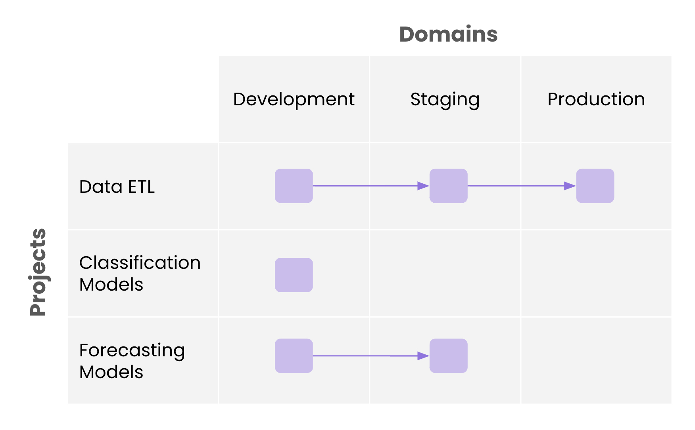

---

# Why Flyte?
## Data Scientist and ML Engineer 💡

.g[
.g-8[
- Machine Learning Workflow
- Bioinformatics Workflow
- LLM Workflow
]
.g-4[

]
]

---

# Machine Learning Workflow

.g.g-middle.g-center[
.g-6[

]
.g-6[

]
]

---

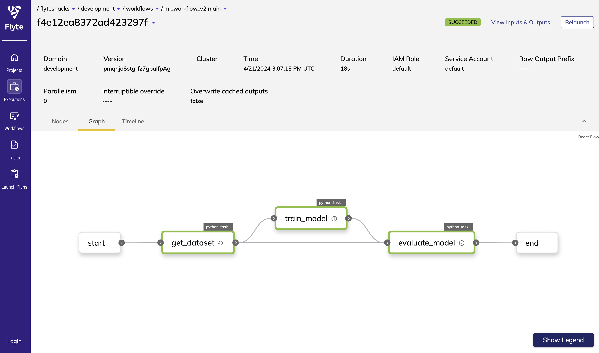

---

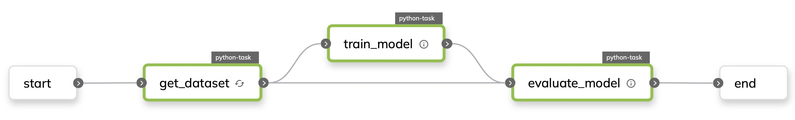

---

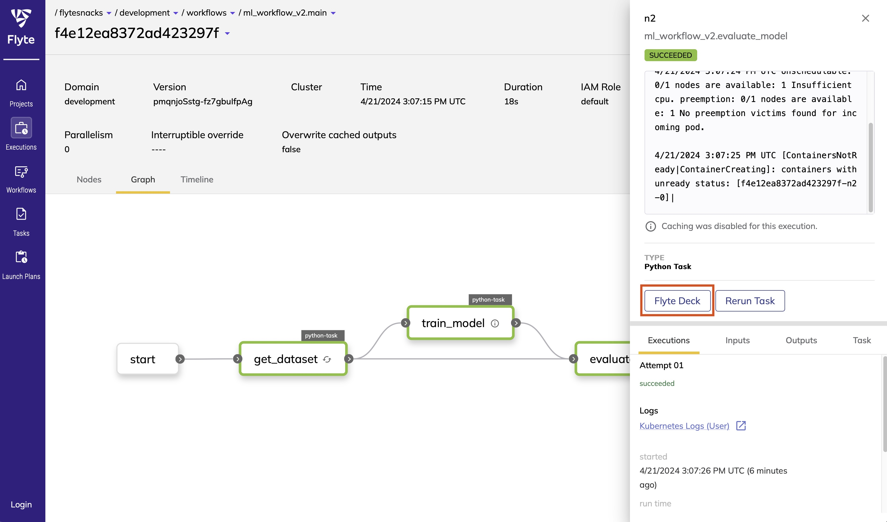

---

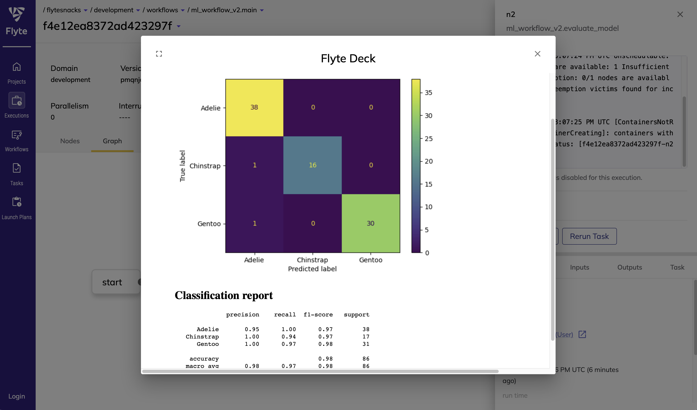

---

# ML Workflow

```python
from flytekit import workflow

@workflow
def main() -> float:
    train, test = get_dataset()
    model = train_model(dataset=train)
    return evaluate_model(model=model, dataset=test)
```


---

# ML Workflow

## Get Dataset

```python
from flytekit import task

@task
def get_dataset() -> tuple[pd.DataFrame, pd.DataFrame]:
    dataset = fetch_openml(name="penguins", version=1, as_frame=True)
    train_dataset, test_dataset = train_test_split(
        dataset.frame, random_state=0, stratify=dataset.target
    )
    return train_dataset, test_dataset
```

---

# Declarative Infrastructure 🏙️

```python
from flytekit import task

@task(
    requests=Resources(cpu="2", mem="2Gi"),
)
def get_dataset() -> tuple[pd.DataFrame, pd.DataFrame]:
    ...
```

---

# Caching 💠

```python
@task(
    requests=Resources(cpu="2", mem="2Gi"),
    cache=True,
    cache_version="3",
)
def get_dataset() -> tuple[pd.DataFrame, pd.DataFrame]:
    ...
```

---

# Python Dependencies 🐳

```python
image = ImageSpec(
    packages=[
        "scikit-learn==1.4.1.post1",
        "pandas==2.2.1",
        "matplotlib==3.8.3",
    ],
)

@task(
    container_image=image,
)
def get_dataset() -> tuple[pd.DataFrame, pd.DataFrame]:
    ...
```

---

# ML Workflow
## Training

```python
@task(
    container_image=image,
    requests=Resources(cpu="3", mem="2Gi"),
)
def train_model(dataset: pd.DataFrame) -> BaseEstimator:
    X_train, y_train = dataset.drop("species", axis="columns"), dataset["species"]
    hist = HistGradientBoostingClassifier(
        random_state=0, categorical_features="from_dtype"
    )
    return hist.fit(X_train, y_train)
```

---

# Visualizations

```python
@task(
    container_image=image,
*   enable_deck=True,
    requests=Resources(cpu="2", mem="2Gi"),
)
def evaluate_model(model: BaseEstimator, dataset: pd.DataFrame) -> float:
    ...
```

.center[

]

---

# Fast Iteration Cycle 🔁

.g[
.g-6[
## Local Execution

```bash
pyflyte run ml_workflow.py main
```
]
.g-6[
## Remote Execution

```bash
pyflyte run --remote ml_workflow.py main
```
]
]

---

# Flyte Task

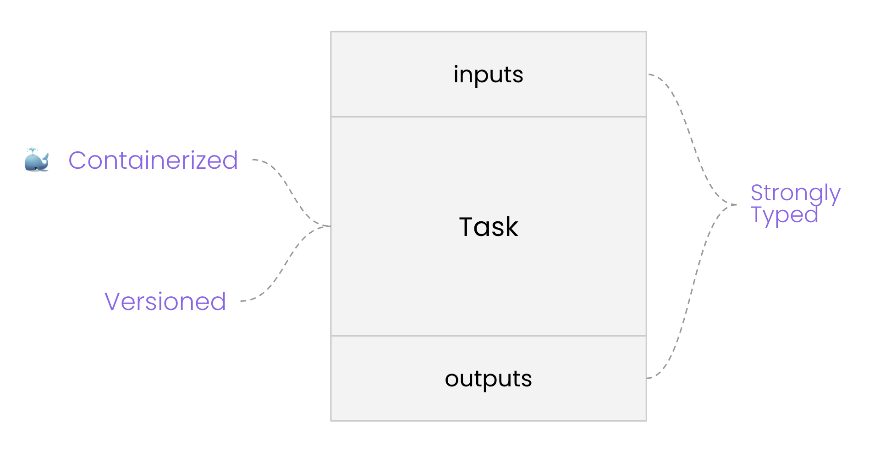

---

# Strong Typing

.center[
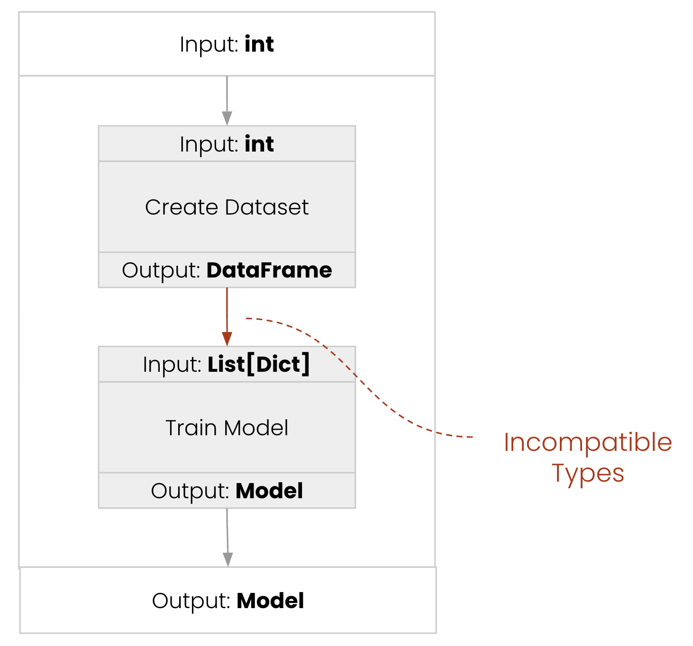
]

---

# Flyte Workflow

.center[
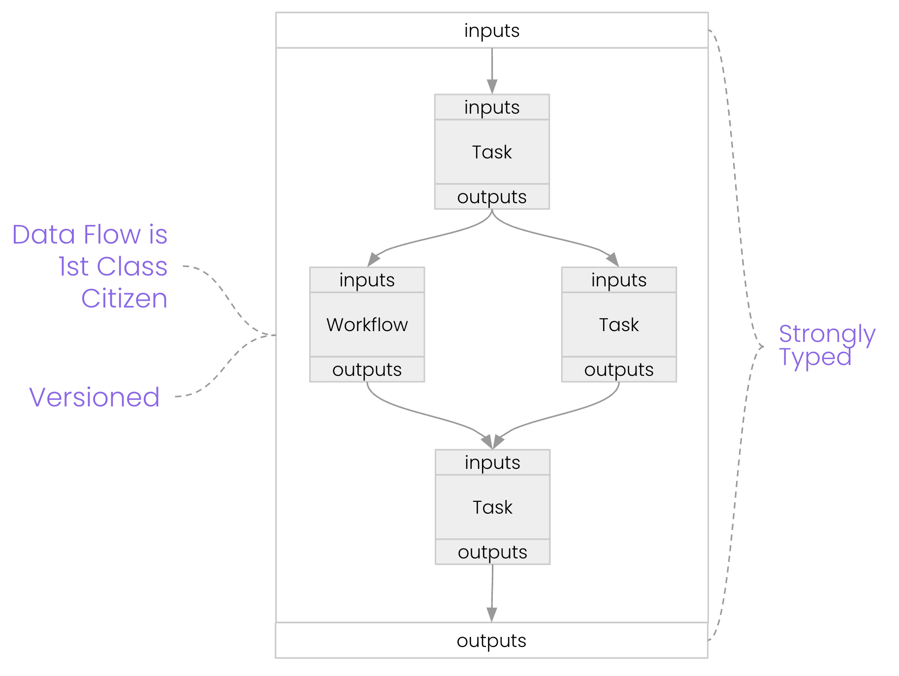
]

---

# Declarative Infrastructure 🏙️

.g[
.g-8[
```python
@task(
    requests=Resources(cpu="2", mem="2Gi"),
)
def get_dataset() -> tuple[pd.DataFrame, pd.DataFrame]:
    ...

```
]
.g-4[

]
]

---

# Declarative Infrastructure

.center[
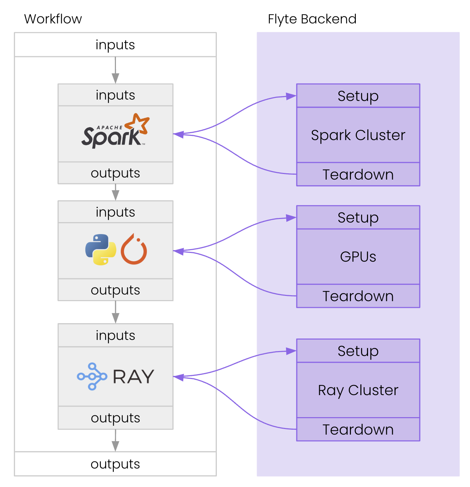
]

---

# External Data

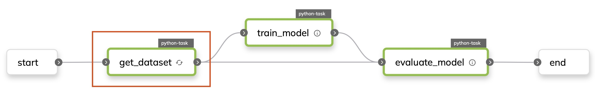

---

## BigQueryTask

.g.g-middle[
.g-8[
```python
from flytekitplugins.bigquery import BigQueryTask

download_data_bigquery = BigQueryTask(
    name="sql.bigquery.w_io"
    query_template="SELECT * FROM ...",
    ...
)

@workflow
def main():
    big_query_output = download_data_bigquery()
```
]
.g-4[

]
]

---

# SQLAlchemyTask

.g.g-middle[
.g-8[
```python
from flytekitplugins.sqlalchemy import SQLAlchemyTask

sql_task = SQLAlchemyTask(
    "rna",
    query_template="""
        select len as sequence_length from rna
        ...
    """,
)
```
]
.g-4[

]
]

---

# Other Data Loading Plugins 🔌

.g[
.g-6[
- BigQuery
- SQL
- DuckDB
- Snowflake
- Spark DataFrame
]
.g-6[


]
]

---

# Scaling Compute

.g.g-middle[
.g-8[
```python
*@task(task_cofig=Spark(...))
def spark_task():
    ...


*@task(task_config=RayJobConfig(...))
def ray_task():
    ...


*@task(task_config=Dask(...))
def dask_task():
    ...


```
]
.g-4[


]
]

---

# Scaling Compute - Flyte Native
## Dynamic workflow

```python
@dynamic
def evaluate_models(models: List[BaseEstimator]) -> List[float]:
    results = []
    for model in models:
        model_result = evaluate_model(model=model)
        results.append(model_result)
    return results
```

---

# Scaling Compute - Flyte Native
## Map tasks

```python
from flytekit import map_task

@workflow
def hyperparameter_optimization(Cs: list[]) -> dict[str, int]:
    results = (
        map_task(train_model_with_parameter)(C=Cs)
        .with_overrides(requests=Resources(mem="20Gi", cpu="2", gpu="1"))
    )
    return find_best_model(results=results)
```

---

class: chapter-slide

# Bioinformatics 🧬

---

# Bioinformatics 🧬

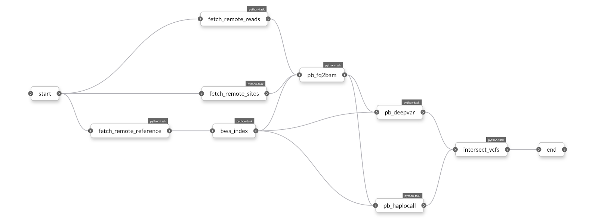

---

# Containers everywhere 🐳

.center[
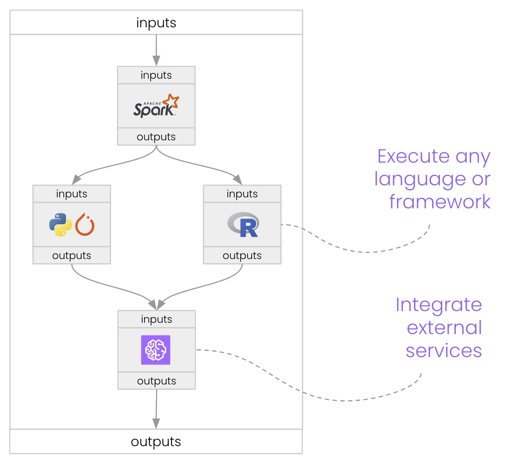
]

---

# Data Persistence

.center[
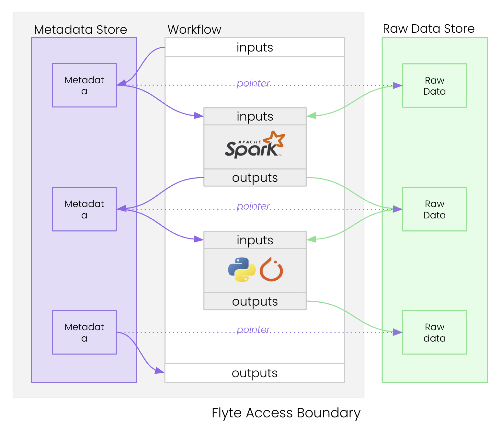
]

---

# Orchestrate CLI commands 🪄

```python
@task(
    container_image=base_image,
    requests=Resources(cpu="4", mem="10Gi"),
)
def bwa_index(ref_obj: Reference) -> Reference:
    ...
    # Calls
    sam_result = subprocess.run(["samtools", ...])
    bwa_result = subprocess.run(["bwa", ...])
```

---

# Data With Metadata 📓

```python
@dataclass
class Reference(DataClassJSONMixin):
    ref_name: str
    ref_dir: FlyteDirectory
    index_name: str | None = None
    indexed_with: str | None = None
```

---

# Running on GPUs 🚀

```python
@task(
    requests=Resources(gpu="1", mem="32Gi", cpu="32")
)
def pb_deepvar(al: Alignment, ref: Reference) -> VCF:
    ...
```

---

# Human In The Loop ✅

```python
approve_filter = approve(
    render_multiqc(...), "filter-approval", timeout=timedelta(hours=2),
)

# Require that samples pass QC before potentially expensive index generation
samples >> approve_filter
approve_filter >> bowtie2_idx
```

---

class: chapter-slide

# LLM Workflow 🤖

---

# Models Everywhere 🪄

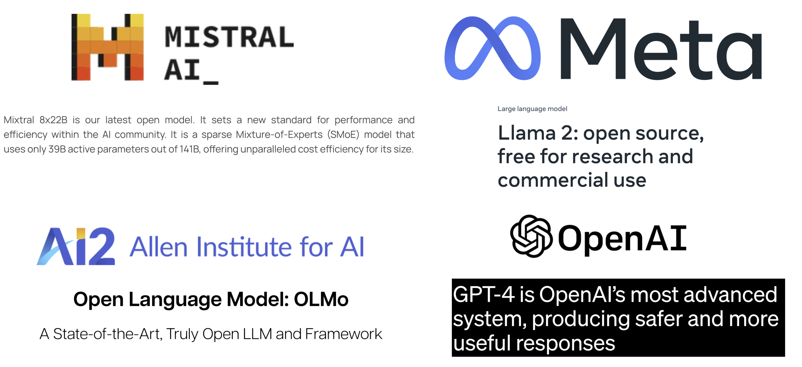

---

# LLM Workflow 🤖

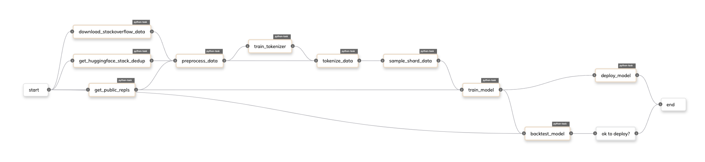

---

# Versioned Workflows

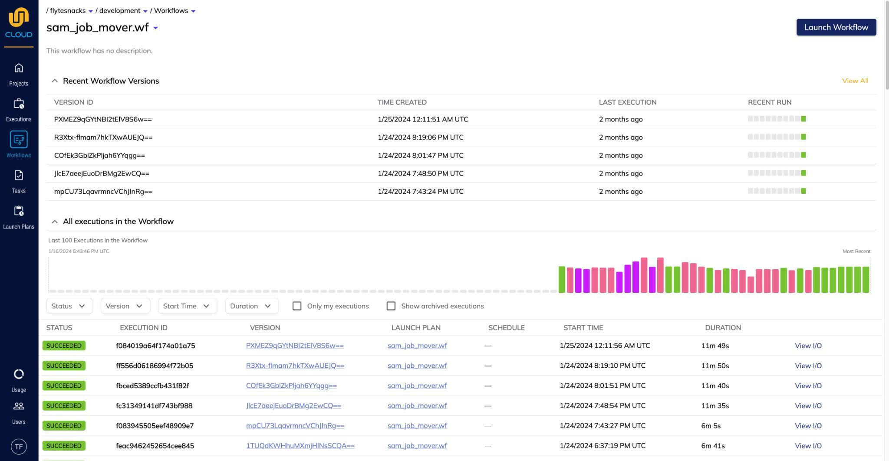

---

# Data Lineage

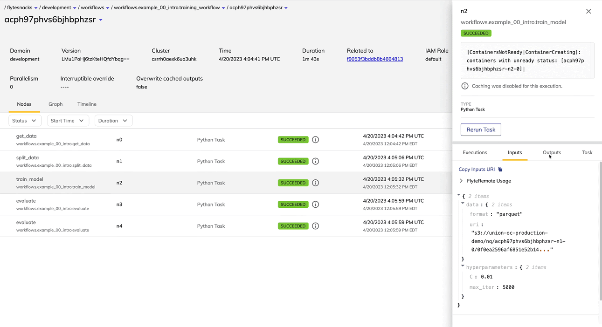

---

# GPU Integrations 🏎️

---

# GPU Support

.g.g-middle[
.g-7[
```python
from flytekit.extras.accelerators import A10G

@task(
    limits=Resources(gpu="1"),
    accelerator=A10G,
)
def my_task() -> None:
    ...

```
]
.g-5[

]
]

---

# Partition GPU

.g.g-middle[
.g-7[
```python
from flytekit.extras.accelerators import A100

@task(
    limits=Resources(gpu="1"),
    accelerator=A100.partition_2g_10gb,
)
def my_task() -> None:
    ...
```
]
.g-5[
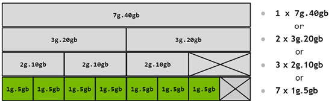
]
]

---

# Elastic Training

.g[
.g-9[
```python
*@task(task_config=TfJob(), limits=Resources(gpu="2"))
def train(hp: Hyperparameters) -> TrainingOutputs:
    strategy = tf.distribute.MirroredStrategy()
    ...
```
]
.g-3[
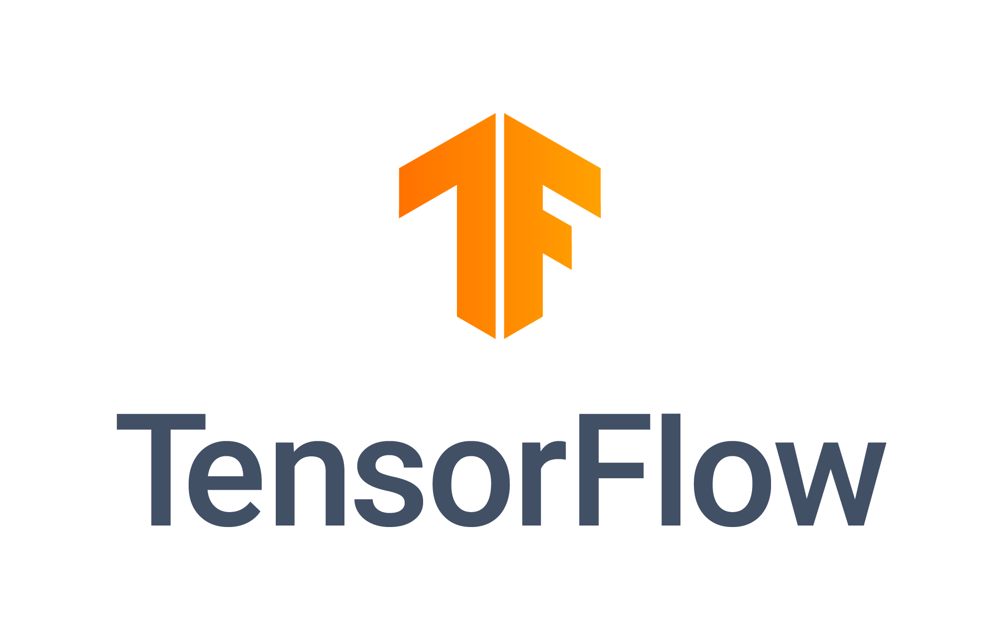
]
.g-9[
```python
*@task(task_config=Elastic(), limits=Resources(gpu="8"))
def train(data: FlyteDirectory, hp: TrainerArgs) -> nn.Module:
    transformers.Trainer(...)

```
]
.g-3[

]
]

---

# Check-pointing with Spot Instances 🏦

```python
from flytekit.extras.accelerators import A100

@task(
*   interruptible=True,
    accelerator=A100,
)
def my_task() -> None:
    cp = current_context().checkpoint
    try:
        # During an iteration, save a checkpoint
        cp.write(...)
    except Exception as e:
        raise FlyteRecoverableException(f“Failed”) from e
```

---

# Extensions 🔌

.g.g-center.g-middle[
.g-6[

]
.g-6[

]
]


---

# Extensions: Agents

.center[
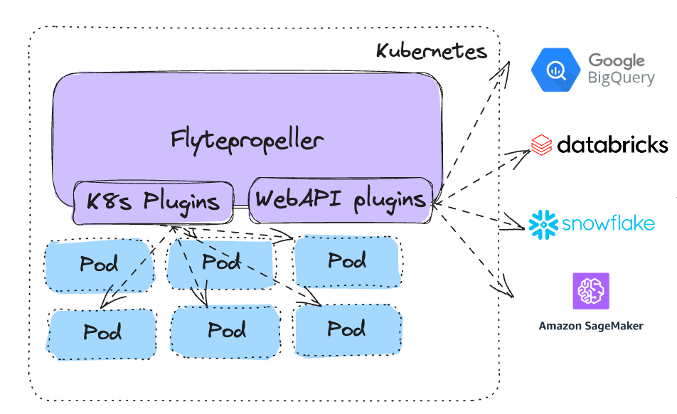
]

---

# Custom Extensions: Agents

.g.g-middle[
.g-8[
```python
@task(
    task_config=DGXConfig(instance="dgxa100.80g.8.norm"),
)
def train(finetuning_args: FinetuningArguments) -> str:
    transformers.Trainer(...)
```
]
.g-4[

]
]

---

# Custom Extensions: Agents

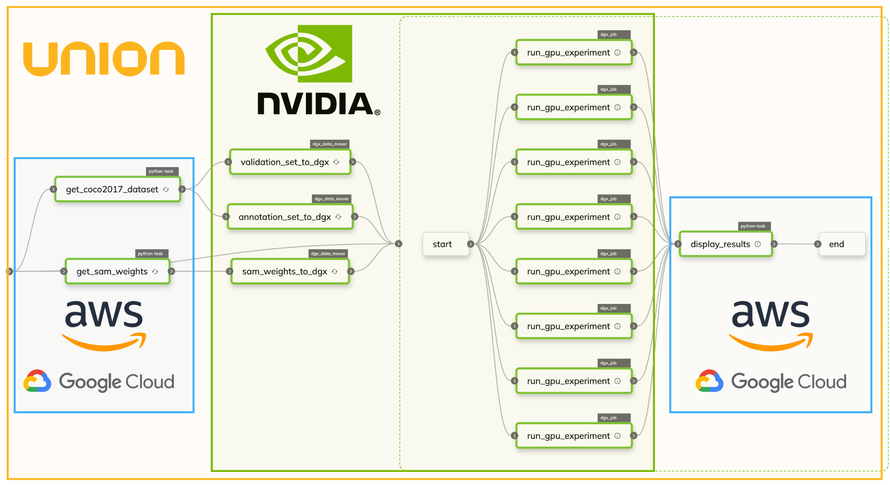

---

# Community 🌎

.g.g-middle[
.g-7[
```python
@vscode
def train_vscode(...) -> str:
    ...
```
]
.g-5.g-center[

]
]

---

# Community 🌎

.center[
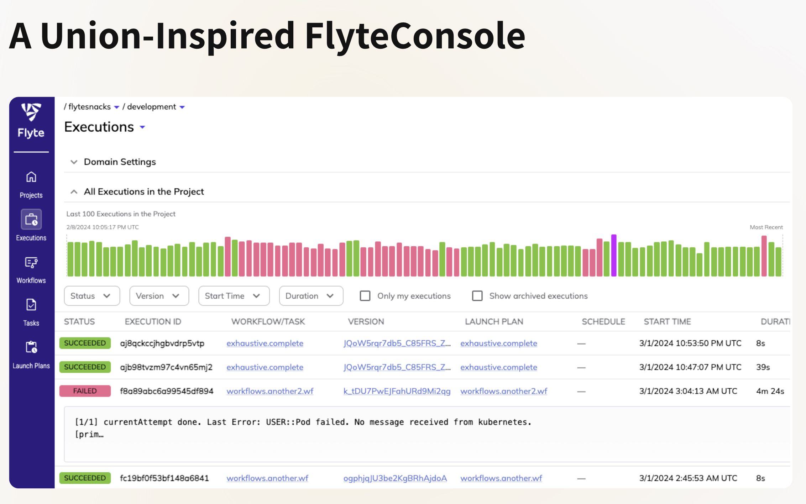
]

---

# Community 🌎

.g.g-middle[
.g-8[
- Join on **Slack**: [slack.flyte.org](slack.flyte.org)
- Join on **GitHub**: [github.com/flyteorg/flyte](github.com/flyteorg/flyte)
]
.g-4[

]
]


---

# Conclusion

.center[

]

.g.g-middle[
.g-5[
- Flyte Overview ✈️
- Machine Learning 💡
- Bioinformatics 🧬
- LLM Workflow 🤖
]
.g-7[
- Join on **Slack**: [slack.flyte.org](slack.flyte.org)
- Join on **GitHub**: [github.com/flyteorg/flyte](github.com/flyteorg/flyte)
- Learn about **Union**: [union.ai/resources](union.ai/resources)
]
]

<br>

### Slides on Github: [github.com/thomasjpfan/odsc-east-2024-flyte](github.com/thomasjpfan/odsc-east-2024-flyte)
### Connect with Me: [linkedin.com/in/thomasjpfan](https://www.linkedin.com/in/thomasjpfan)
